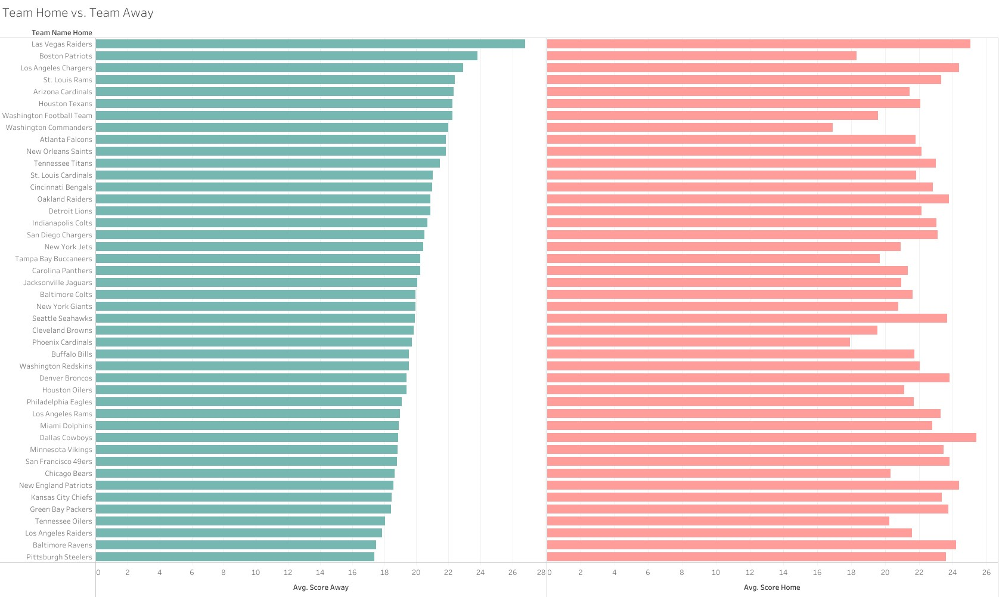
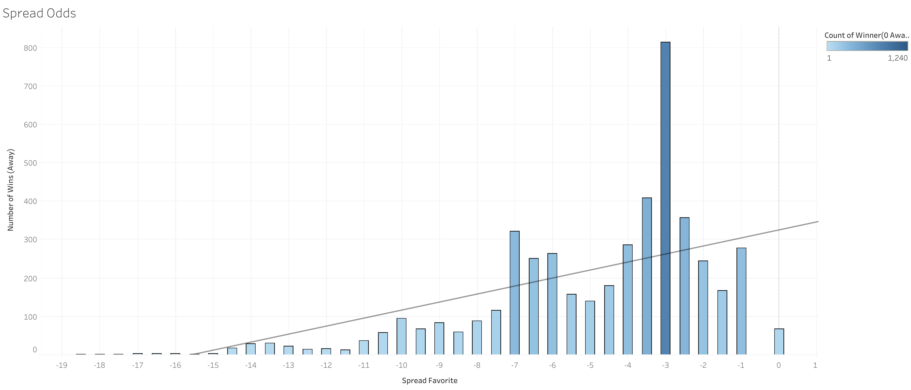
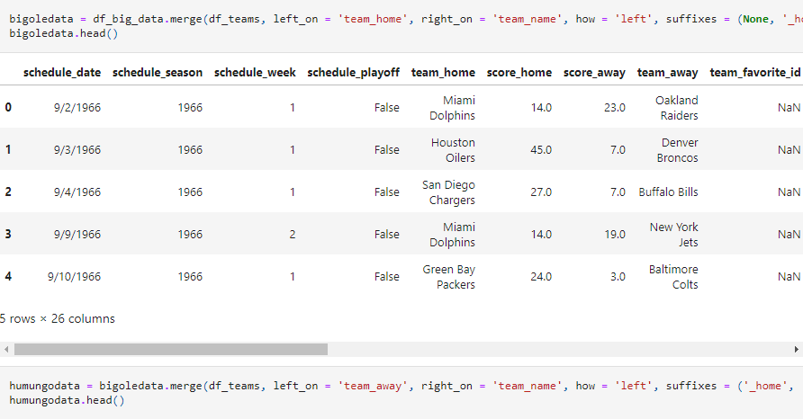
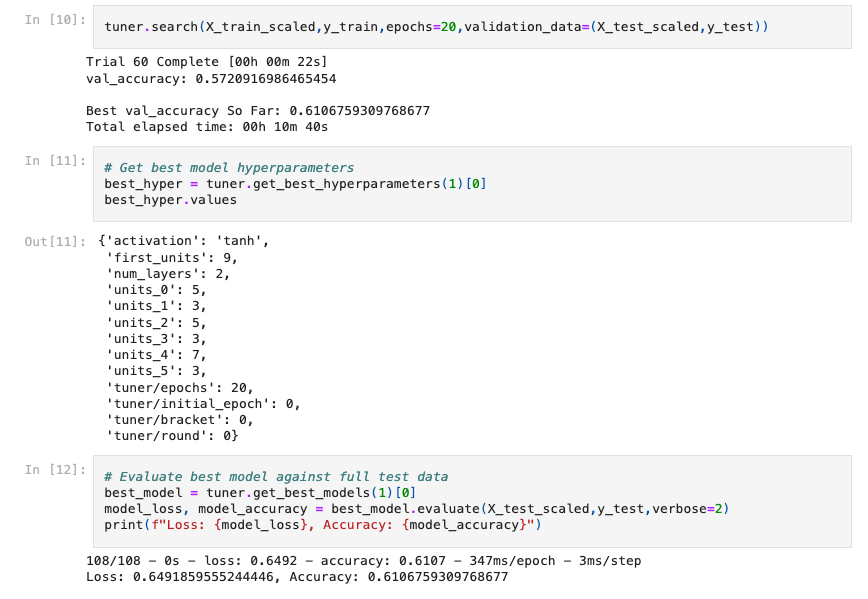
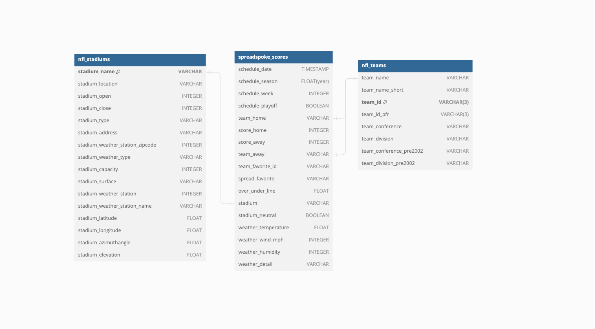

# project_4
## Table of Contents

- [Project Description/Outline](#project_description)
- [Questions](#questions)
- [Contents of the Repository](#repository_contents)
- [Task Assignments](#task_assignments)
- [Givens](#givens)
- [Conclusion](#conclusion)

## Project_Description
Develop a machine learning model to forecast the winning NFL football team in a given game.  

## Questions
1. Does weather affect the outcome of a football game? 
2. Does a team being Home or away affect the outcome of a football game?

3. Does the conferences of the Football teams affect who will win the game?
4. Does when the game is played affect who will win the game?
5. Does the points score affect who will win the football game?
6. Do Stadium conditions (Capacity and grass) affect who will win the football game?
7. Does the game being a playoff game affect who will win the football game?
8. Does the spread of the game affect who will win the football game?

## Repository_Contents
data_manipulation.ipynb takes the csvs and combines them as well as manipulates the words to be numbers. 

machine_learning.ipynb takes the manipulated csvs and uses keras tuner to determine the layers. 

README.md  

#### Data
nfl_stadiums.csv - Given initial Data  
nfl_teams.csv - Given initial Data  
spreadspoke_scores.csv - Given initial Data  
tableau_data.csv - is the data to be used to look at the data in visualizations in tableau  
2000sData.csv - is all of the data as numbers just from 2000-2022 which we used in hopes to get better Machine Learning numbers 
final_data.csv - all of the data used in Machine Learning 

Here is an Entity Relationship Diagram for our data sets:

#### Images
ERD.png - Shows the entity relationship diagram 

## Task_Assignments
Ryland - Machine Learning  
Brittney - Tableau and Visualizations 
Jonah - Tableau and Visualizations 
Alysa - Visualizations and Perfecting Presentation 
Louis - Manipulating Data 

## Givens
Instructions were generated by edX Boot Camps LLC, and is intended for educational purposes only. 
Data was provided by: https://www.kaggle.com/datasets/tobycrabtree/nfl-scores-and-betting-data/data?select=spreadspoke_scores.csv

## Conclusion
We attempted to use stadium, weather and the teams playing to determine who would win each NFL Football game. We used factors like if it was indoor/outdoor, turf/grass, rain or shine and more. We truly hoped that this would help us to determine who would win the game, the home team or the away team or a tie. 

We used the Keras Tuner library in conjunction with neural networks to train and test the data to discover if we could use these factors and machine learning to predict the outcome of the NFL game. We ran 60 Trials using 20 Epochs with tanh, relu and sigmoid as our 3 possible activations in the layers. In the end, we found the accuracy to be about 61.1%.  

This value was expected because if the outside factors could tell you who would win then the game wouldn't need to be played. In the end, there will always be a human factor which causes this to not be possible. 

All of that being said, a 61.1% prediction of who is going to win the game is more than 50%. The machine is able to make a solid prediction as to who will win the game each week. It is not close to being guaranteed but it is a solid enough prediction that it is worth consideration.  

In finality, we had hoped to find a revolutionary way to predict who was going to win each football game each week. Using the factors we were given though, there was not a consistent way to make that determination.
